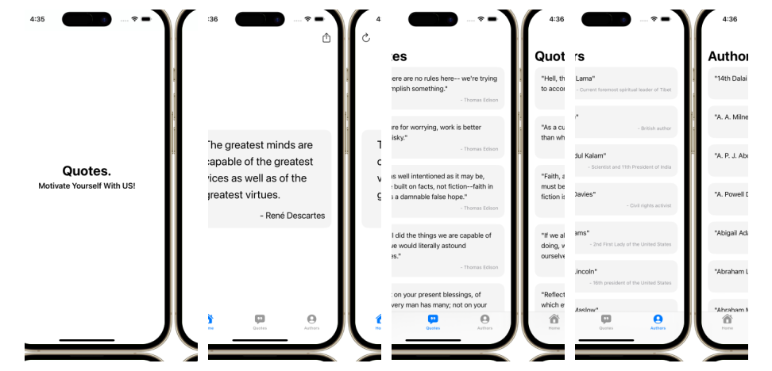

# Quotes Application Using SwiftUI

## Description
Welcome to **QuotesAppSwiftUI**! This project showcases my learning journey with SwiftUI, the Combine framework, and MVVM architecture. It is developed as an example application that presents random quotes, a collection of quotes, and a list of authors. The goal is to demonstrate the power and simplicity of SwiftUI in building modern iOS applications.

## Features
- **Random Quote**: Get inspired with a randomly selected quote.
- **List of Quotes**: Browse through a comprehensive list of quotes and view detailed information for each one.
- **List of Authors**: Explore a list of authors and dive into details about their lives and works.

## Technologies Used
- **SwiftUI**: Leverages the latest UI framework from Apple to create a clean and intuitive user interface.
- **Combine**: Utilizes the reactive programming framework to handle asynchronous events and data binding seamlessly.
- **MVVM Architecture**: Implements the Model-View-ViewModel pattern for a clear separation of concerns, making the code more modular and maintainable.

## App Preview

Explore the source code to see how SwiftUI, Combine, and MVVM come together to create a smooth and responsive user experience. Feel free to fork the repository, open issues for any bugs or enhancements, and contribute to the project!
